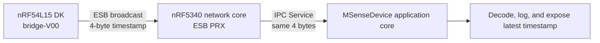

# ESB Time-Synchronization Proof-of-Concept Implementation Plan

**Target plan file:** `C:\nathan\MotionSenseHRV4Flash\ESB_TIME_SYNC_POC_IMPLEMENTATION_PLAN.md`

## 1. Objective and fixed decisions

Implement a two-device proof of concept using NCS v2.9.3:



- The bridge uses `nrf54l15dk/nrf54l15/cpuapp`.
- Start `bridge-V00` from Nordic’s `nrf/samples/esb/esb_ptx` example.
- The bridge transmits the low 32 bits of a 1024 Hz crystal-derived counter.
- The payload is exactly four bytes, little-endian.
- Capture the counter immediately before calling `esb_write_payload()`.
- Delay between transmission attempts is uniformly randomized from 1000–3000 ms inclusive.
- Use unacknowledged ESB broadcasts.
- Use the highest bitrate shared by nRF54L15 and nRF5340: `ESB_BITRATE_2MBPS`.
- Use ESB DPL, 16-bit CRC, pipe 0, 0 dBm, and proof-of-concept RF channel 50.
- MSenseDevice’s existing 512 Hz collection counter remains unchanged.
- No clock-synchronization algorithm, security, BLE coexistence, production protocol versioning, or long-duration rollover handling is included.
- The current BLE-enabled MSense build must continue to compile after refactoring, but runtime BLE/ESB coexistence is deferred.

## 2. Offline NCS references

The implementor must not require Nordic MCP. Use these NCS v2.9.3 sources:

- Bridge starting point:  
  `C:\ncs\v2.9.3\nrf\samples\esb\esb_ptx`
- Receiver radio starting point:  
  `C:\ncs\v2.9.3\nrf\samples\esb\esb_prx`
- nRF5340 IPC/sysbuild pattern:  
  `C:\ncs\v2.9.3\nrf\samples\ipc\ipc_service`
- ESB API and defaults:  
  `C:\ncs\v2.9.3\nrf\include\esb.h`
- GRTC driver API:  
  `C:\ncs\v2.9.3\modules\hal\nordic\nrfx\drivers\include\nrfx_grtc.h`
- GRTC HAL clock-source definitions:  
  `C:\ncs\v2.9.3\modules\hal\nordic\nrfx\hal\nrf_grtc.h`
- Zephyr GRTC system timer and LFXO selection:  
  `C:\ncs\v2.9.3\zephyr\drivers\timer\nrf_grtc_timer.c`
- nRF54L15 DK LFXO configuration:  
  `C:\ncs\v2.9.3\zephyr\boards\nordic\nrf54l15dk\nrf54l_05_10_15_cpuapp_common.dtsi`
- Sysbuild remote-image example:  
  `C:\ncs\v2.9.3\zephyr\samples\sysbuild\hello_world`

Preserve Nordic sample copyright and `LicenseRef-Nordic-5-Clause` headers in derived files.

## 3. Shared radio and payload definition

Create a repository-owned shared header, for example:

`common/esb_time_sync_protocol.h`

It must be usable by the bridge, nRF5340 network core, and MSense application core.

Define these fixed proof-of-concept values:

- `ESB_TIME_SYNC_PAYLOAD_SIZE = 4`
- `ESB_TIME_SYNC_TICKS_PER_SECOND = 1024`
- `ESB_TIME_SYNC_RF_CHANNEL = 50` (2450 MHz)
- `ESB_TIME_SYNC_PIPE = 0`
- Base address 0: `{ 0x54, 0x53, 0x59, 0x4E }`
- Pipe-0 prefix: `0xA7`
- Bitrate: `ESB_BITRATE_2MBPS`
- Protocol: `ESB_PROTOCOL_ESB_DPL`
- CRC: `ESB_CRC_16BIT`
- TX power: 0 dBm
- Selective auto-ack enabled so the per-payload `noack` flag is recognized.
- Every timestamp payload sets `noack = true`.
- Retransmit count is zero to prevent accidental retries.

Provide small inline encode/decode helpers using `sys_put_le32()` and `sys_get_le32()`. Do not cast the payload buffer to `uint32_t *`; that would create alignment and host-endianness assumptions.

Document the timestamp as:

> Unsigned low 32 bits of elapsed bridge time in 1/1024-second units since bridge boot. Arithmetic and comparisons use modulo-2³² semantics.

Keep channel, address, bitrate, and power in this one shared definition so PTX and PRX cannot silently diverge.

## 4. Bridge firmware

### 4.1 Project creation

Copy the structural minimum from `nrf/samples/esb/esb_ptx` into the existing `bridge-V00` directory:

- `CMakeLists.txt`
- `prj.conf`
- `Kconfig` only if application-specific logging options are retained
- `sample.yaml`
- Required source and license headers

Do not retain sample LED animation, counter payload, ACK workflow, or arbitrary sample addresses.

Use a modular layout:

- `src/main.c`: initialization and scheduling only
- `src/bridge_timebase.c/.h`: LFXO/GRTC validation and timestamp reads
- `src/esb_time_tx.c/.h`: HF clock, ESB configuration, and transmission
- Shared protocol header from `common/`

Add the shared include directory through CMake. Do not hard-code the board in `CMakeLists.txt`.

### 4.2 Configuration

`prj.conf` must enable only the required facilities:

- NCS sample defaults
- ESB
- clock control
- logging
- random subsystem/entropy support
- hardware stack protection
- GRTC system counter and `CONFIG_NRF_GRTC_ALWAYS_ON=y`
- assertions for the debug proof-of-concept build
- Bluetooth disabled

Avoid the DK LED library unless a single status LED is intentionally retained for diagnostics.

Add `sample.yaml` as a build-only test for:

`nrf54l15dk/nrf54l15/cpuapp`

### 4.3 Crystal-derived 1024 Hz timebase

The nRF54L15 uses GRTC rather than nRF53-style RTC0.

The board devicetree already defines the LFXO in crystal mode with internal load capacitors. The Zephyr GRTC system timer selects LFXO when the LFXO node is enabled.

Implement the following safeguards:

1. Compile-time assert that `DT_NODELABEL(lfxo)` has status `okay`.
2. At startup, verify `nrfx_grtc_ready_check()` succeeds.
3. Read the active GRTC source with `nrf_grtc_clksel_get(NRF_GRTC)`.
4. Require `NRF_GRTC_CLKSEL_LFXO`; log a fatal error and do not transmit otherwise.
5. Log once that the GRTC source is LFXO and the exported rate is 1024 Hz.

Use `nrfx_grtc_rtcounter_get()`, whose RTCOUNTER operates at 32.768 kHz. Convert to 1024 Hz with an exact divide by 32:

```c
uint64_t raw_32768_hz = nrfx_grtc_rtcounter_get();
uint32_t ticks_1024_hz = (uint32_t)(raw_32768_hz >> 5);
```

Do not initialize or clear GRTC directly; Zephyr’s system timer owns its initialization. The epoch is bridge boot.

### 4.4 Radio clock initialization

Carry over the PTX example’s clock-start implementation, including:

- Clock-control request and result checking.
- The `CONFIG_CLOCK_CONTROL_NRF` and `CONFIG_CLOCK_CONTROL_NRF2` branches needed by supported platforms.
- The nRF54L15 PLL-start handling present in the NCS 2.9.3 example.

Do not assume the LFXO supplies the radio. ESB requires the HF radio clock independently.

### 4.5 Transmission loop

Initialize ESB with the shared configuration and project-specific address.

Use a semaphore or another ISR-safe signal between the ESB event callback and the main transmission loop. Do not use an unsynchronized plain boolean modified from callback context.

For every transmission:

1. Generate a uniformly distributed delay from 1000–3000 ms inclusive.
2. Sleep for that delay.
3. Confirm the prior TX operation is idle; recover or fail visibly on timeout.
4. Flush stale TX state before timestamp capture.
5. Read the GRTC-derived 1024 Hz timestamp.
6. Encode it little-endian into a four-byte `struct esb_payload`.
7. Set pipe 0, length 4, and `noack = true`.
8. Immediately call `esb_write_payload()`.
9. Log the timestamp and requested delay only after enqueueing so logging does not increase capture-to-radio latency.
10. Wait for `ESB_EVENT_TX_SUCCESS` with a bounded timeout before scheduling the next attempt.

Treat initialization failures as fatal. For a runtime enqueue or TX timeout, log the error, flush TX state, and wait for a newly generated randomized interval; do not busy-loop.

Use `sys_rand32_get()` with rejection sampling over a 2001-value range if exact uniformity is desired. A fixed seed or deterministic test generator is not acceptable in the hardware build.

## 5. MSenseDevice network-core receiver

### 5.1 New network-core image

Create a dedicated child application under:

`MSenseDevice/esb_rx_netcore`

Base its radio code on Nordic’s `nrf/samples/esb/esb_prx` example and its IPC setup on `nrf/samples/ipc/ipc_service`.

Target:

`nrf5340dk/nrf5340/cpunet`

The image owns:

- nRF5340 RADIO
- ESB PRX
- Radio HF clock initialization
- IPC Service endpoint
- A small queue between the ESB callback and IPC thread

It must not enable Bluetooth.

### 5.2 Receiver initialization order

Initialize in this order:

1. Open the IPC Service instance.
2. Register endpoint name `esb_time_sync`.
3. Wait for the application-core endpoint to bind.
4. Start the HF radio clock using the NCS PRX sample pattern.
5. Initialize ESB PRX with the shared configuration.
6. Call `esb_start_rx()`.

Waiting for IPC binding before starting RX prevents accepted radio packets from being lost during application-core startup.

### 5.3 ESB receive callback

In `ESB_EVENT_RX_RECEIVED`:

1. Drain the ESB RX FIFO with `esb_read_rx_payload()`.
2. Accept only pipe 0 and length 4.
3. Copy the four payload bytes into a statically allocated `k_msgq`.
4. Use `K_NO_WAIT`; never call IPC send, log extensively, allocate memory, or block from the ESB callback.
5. Count invalid-length, wrong-pipe, and queue-overflow drops separately.

A dedicated worker thread drains the queue and calls `ipc_service_send()`.

For transient `-ENOMEM`, retry with bounded backoff from thread context. For persistent IPC failure, record the error and continue receiving without crashing the network core.

The IPC message remains exactly the four over-the-air bytes in this iteration. Receiver-side arrival timestamps and clock synchronization are deferred.

## 6. MSenseDevice application-core integration

### 6.1 IPC receiver module

Add a module such as:

- `src/esb_time_rx.c`
- `src/esb_time_rx.h`

Public interface:

```c
int esb_time_rx_init(void);
bool esb_time_rx_latest_get(uint32_t *bridge_ticks_1024);
```

Behavior:

- Open the application-core IPC instance.
- Register endpoint `esb_time_sync`.
- In the endpoint callback, require exactly four bytes and copy them into a message queue or work item.
- Decode little-endian outside the IPC callback.
- Atomically publish the latest decoded timestamp.
- Log each accepted timestamp for proof-of-concept observation.
- Return `false` from `esb_time_rx_latest_get()` until at least one packet has been accepted.
- Do not alter MSenseDevice’s RTC0, collection timestamps, sensor data, or files.

Call `esb_time_rx_init()` early in application startup. IPC initialization failure must be visible and must prevent claiming that the receiver is operational, but it must not corrupt storage.

### 6.2 Decouple RTC0 from BLE

The current collection clock implementation is inside `BLEService.c`, although recording code uses it independently of BLE.

Extract it into:

- `src/collection_clock.c`
- `src/collection_clock.h`

Keep the existing MSense counter at 512 Hz and preserve these behaviors:

- RTC0 prescaler and 512 Hz rate
- Counter clear on collection start
- 24-bit hardware rollover extension to 32 bits
- Existing start, stop, and get error semantics
- Existing collection-file timestamp interpretation

Move BLE timing-notification behavior behind a generic collection-clock alarm/callback interface or otherwise keep it strictly Bluetooth-conditional. The non-BLE receiver build must not start BLE timing notifications.

Move shared device/collection state currently defined in `BLEService.c` into a radio-independent state module if those symbols are required when BLEService is excluded.

### 6.3 Make BLE optional at compile time

Update application CMake and source guards so `CONFIG_BT=n` is a valid build:

- Compile `BLEService.c` only when `CONFIG_BT=y`.
- Guard Bluetooth headers, advertising data, connection callbacks, initialization, and notification calls in `main.c`.
- Do not leave unresolved Bluetooth types in headers included by the non-BLE build.
- Keep collection mode, sensors, filesystem, USB, and the extracted RTC0 module available.
- Preserve the current BLE-enabled build behavior when `CONFIG_BT=y`.

Avoid wrapping the entire existing file in one large preprocessor block; isolate BLE dependencies at module boundaries.

## 7. Sysbuild and configuration variants

### 7.1 Preserve the existing build

The existing default must continue to select:

- MCUboot
- `hci_ipc`
- Bluetooth-enabled application configuration

Do not silently change the existing production/development variant into ESB mode.

### 7.2 Add an ESB receiver variant

Create:

- `MSenseDevice/Kconfig.sysbuild`
- `MSenseDevice/sysbuild-esb.conf`
- `MSenseDevice/esb_receiver.conf`

Define a sysbuild option such as:

`SB_CONFIG_MSENSE_ESB_RX`

The ESB sysbuild configuration must select:

- MCUboot enabled
- `SB_CONFIG_NETCORE_HCI_IPC=n`
- `SB_CONFIG_MSENSE_ESB_RX=y`

Update `sysbuild.cmake` so:

- `hci_ipc` is configured only for the existing BLE variant.
- `esb_rx_netcore` is added with `ExternalZephyrProject_Add()` for the ESB variant.
- CPUNET partition-manager domain properties follow the NCS IPC sample.
- Configure and flash dependencies place the network-core image before the application image.
- Configuration fails with a clear message if both HCI IPC and ESB RX are selected.

`esb_receiver.conf` must disable Bluetooth and enable the application-core side of IPC Service/OpenAMP, mailbox support, and network-core startup. Follow the nRF5340 CPUAPP settings from the NCS IPC sample rather than inventing shared-memory addresses.

## 8. Build workflow

Use the pinned NCS v2.9.3 wrapper environment. Never invoke `west` directly from ordinary PowerShell.

### 8.1 Bridge build

Use:

- Application: `C:\nathan\MotionSenseHRV4Flash\bridge-V00`
- Build directory: `C:\nathan\MotionSenseHRV4Flash\bridge-V00\build`
- Board: `nrf54l15dk/nrf54l15/cpuapp`
- Pristine build
- No manually added `CMAKE_EXPORT_COMPILE_COMMANDS`; the wrapper injects it

Prepare `C:\nathan\NordicMCP\west-ncs-build-request.json` with those paths and the required `prj.conf`.

### 8.2 MSense ESB build

Use a separate directory so the existing BLE build is not overwritten:

- Application: `C:\nathan\MotionSenseHRV4Flash\MSenseDevice`
- Build directory: `C:\nathan\MotionSenseHRV4Flash\MSenseDevice\build_esb`
- Board: `nrf5340dk/nrf5340/cpuapp`
- Pristine sysbuild
- `-DCONF_FILE=prj.conf`
- `-DEXTRA_CONF_FILE=esb_receiver.conf`
- `-DSB_CONF_FILE=sysbuild-esb.conf`
- Preserve the existing application devicetree overlay argument

### 8.3 Mandatory wrapper lifecycle

For each actual build:

1. Run the fixed preflight:
   `C:\nathan\NordicMCP\test-west-ncs-environment.cmd`
2. Start using:
   `C:\nathan\NordicMCP\start-west-ncs-build.cmd`
3. Poll every 15–30 seconds with:
   `C:\nathan\NordicMCP\get-west-ncs-build-status.cmd`
4. If delegated, attest using the reported run ID:
   `C:\nathan\NordicMCP\confirm-west-ncs-build-result.cmd -RunId <run-id>`

A Codex implementor must delegate each actual NCS build to exactly one `ncs_build_runner` Terra agent as required by repository instructions. Do not run `-ValidateOnly` before an actual build.

Success requires `BUILD_ACCEPTANCE=passed`, `OUTCOME=succeeded`, and exit code zero.

### 8.4 Regression build

After the ESB variant succeeds, rebuild the existing default MSense BLE/sysbuild configuration in its existing selected build directory or a separate `build_ble_regression` directory. This confirms that extracting RTC0 and making BLE conditional did not break the current firmware.

## 9. Tests and verification

### 9.1 Static and unit tests

Add tests for:

- Encoding `0x12345678` as bytes `78 56 34 12`.
- Decoding the same bytes.
- Payload-size rejection for 0, 3, 5, and oversized messages.
- 32.768 kHz to 1024 Hz conversion at boundaries.
- Truncation to low 32 bits.
- Random delay always within 1000–3000 ms.
- Latest-value API returning unavailable before the first IPC packet.
- Latest-value replacement after multiple packets.
- Queue-overflow behavior without blocking callback context.

### 9.2 Build assertions

Bridge build must establish:

- Exact nRF54L15 CPUAPP board target.
- `CONFIG_ESB=y`.
- Bluetooth disabled.
- GRTC and LFXO nodes enabled.
- No warnings for implicit declarations, incompatible pointers, missing returns, or undefined symbols.

MSense ESB build must establish:

- Application, MCUboot, and `esb_rx_netcore` images exist.
- No `hci_ipc` image is included.
- Application Bluetooth is disabled.
- Both IPC endpoints compile with the same endpoint name.
- Expected application/network-core ELF and HEX artifacts exist.
- A merged sysbuild HEX is present when generated.

Default MSense regression build must still contain `hci_ipc` and Bluetooth.

### 9.3 Hardware proof

Hardware interaction is a separate step and requires the appropriate approval before flashing.

Use one nRF54L15 DK as PTX and one nRF5340-based MSense target as PRX.

Verify:

1. Bridge startup reports LFXO as the active GRTC source.
2. Bridge continues transmitting when no receiver is present, proving broadcasts do not wait for ACK.
3. MSense application reports IPC endpoint binding.
4. Network core enters continuous ESB RX.
5. At least 30 valid four-byte timestamps are received.
6. Decoded timestamps increase modulo 2³².
7. Adjacent timestamp differences normally fall near 1024–3072 ticks, allowing small scheduling tolerance.
8. Observed transmit intervals include multiple distinct values rather than a fixed cadence.
9. Invalid payload lengths are rejected without affecting later valid packets.
10. Resetting the bridge restarts its epoch near zero and does not require resetting MSenseDevice.
11. No sensor, filesystem, USB, or collection-mode regression appears in the non-BLE application.

Do not flash, erase, recover, start a debugger, or access UART merely because the build succeeds.

## 10. Completion criteria

The proof of concept is complete when:

- `bridge-V00` is recognizably derived from Nordic’s ESB PTX example but contains project-specific modular code.
- The bridge uses an explicitly verified LFXO-driven GRTC timebase.
- Every ESB packet contains exactly one little-endian 1024 Hz `uint32_t`.
- Broadcasts occur at randomized 1–3 second intervals at 2 Mbps with no ACK or retry.
- The nRF5340 network core receives ESB and forwards the same four bytes over IPC.
- MSenseDevice decodes, logs, and exposes the latest bridge timestamp.
- MSenseDevice’s existing 512 Hz collection counter and data formats remain unchanged.
- Bridge, ESB receiver, and existing BLE regression builds all pass.
- Build logs, significant warnings, exact artifacts, and final git status are recorded.
- Ignored build artifacts are distinguished from source changes.

## 11. Deferred work

Explicitly defer:

- Estimating bridge-to-MSense clock offset and drift.
- Receiver-side arrival timestamp capture.
- Cross-core RTC synchronization.
- Clock discipline or adjustment.
- Sequence numbers, sender identity, version fields, and rollover recovery.
- Packet authentication or encryption.
- RF channel selection based on spectrum measurements.
- BLE and ESB coexistence through MPSL timeslots.
- Porting or validating the external NCS 2.6 coexistence demo.
- Production power optimization and long-duration reliability.
